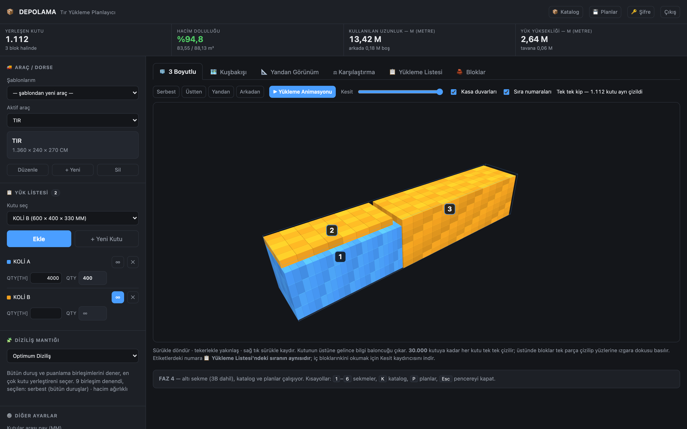
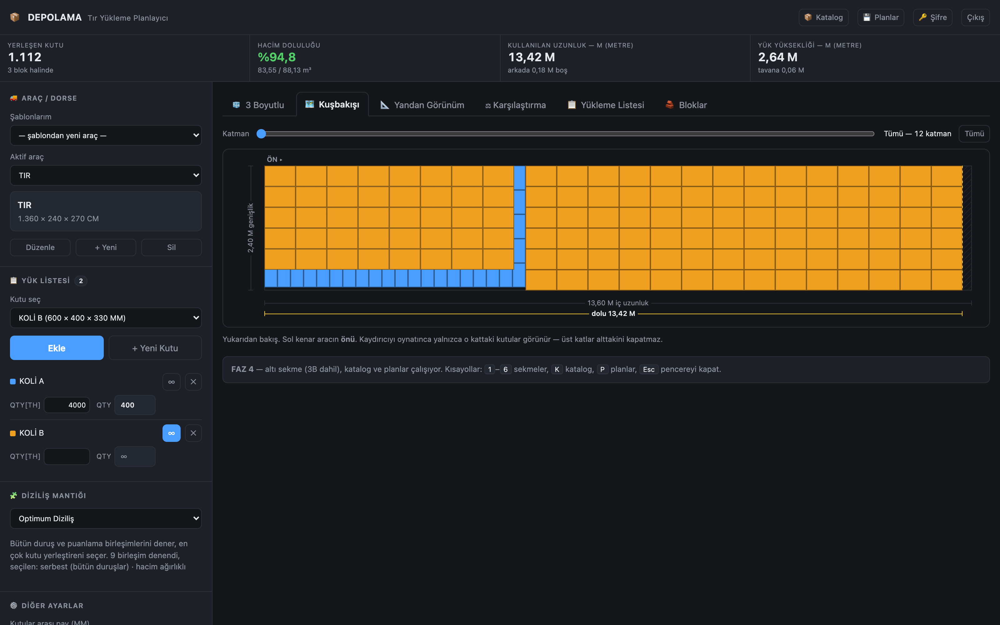
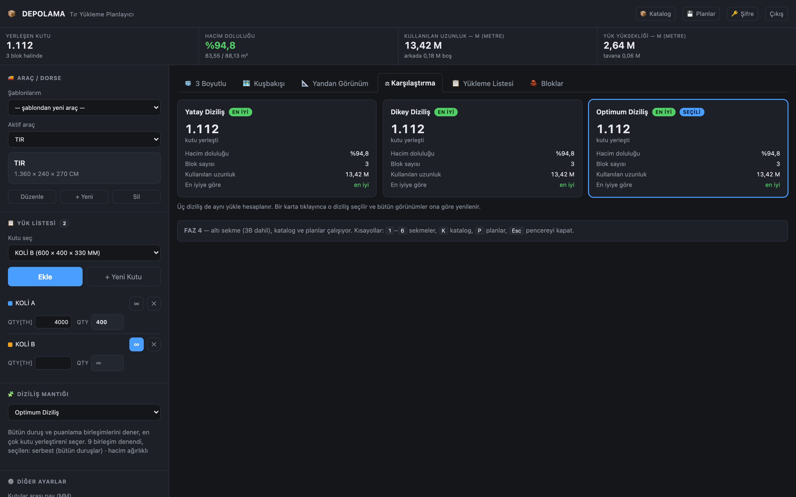

# DEPOLAMA — Tır Yükleme Planlayıcı

Bir tırın içine kutuları en verimli nasıl dizeceğini hesaplayan ve sonucu 2 boyutlu
(kuşbakışı, yandan kesit) ve 3 boyutlu gösteren web uygulaması.

**Hiçbir çerçeve kullanılmadı** — Express yok, React yok, paketleyici yok, ORM yok.
Tek çalışma zamanı bağımlılığı Postgres sürücüsü. Bütün HTTP yolları, tuvale çizilen
her piksel ve yerleştirme motorunun tamamı elle yazıldı.

**[Canlı site](https://depo-test-deniz-zkbp.onrender.com)** · giriş gerekir —
uygulama gerçek yük verisi tuttuğu için herkese açık değil. Aşağıdaki ekran
görüntüleri arayüzün tamamını gösteriyor.

> English README: **[README.md](README.md)**

---

## Ne yapıyor

Bir dorse ve kutu tipleri tanımlıyorsun, her birinden kaç tane göndereceğini
yazıyorsun; motor dizilişi çıkarıyor — hangi kutu nereye, hangi duruşta, hangi
yükleme sırasıyla.



*3B görünüm — 3 blok halinde 1.112 kutu, %94,8 hacim doluluğu. Etiketlerdeki
numaralar yükleme sırası.*



*Kuşbakışı, katman kaydırıcısıyla — kaydırınca bütün istif yerine tek bir katman
görünüyor.*



*Aynı yük üç diziliş mantığıyla birden hesaplanıp yan yana konuyor, en iyisi
işaretleniyor.*

---

## İşin ilginç yanı: kutu değil, blok

Düz yaklaşım kutuları teker teker yerleştirir. 900.000 paketi böyle yüklemek
900.000 yerleştirme kararı demek.

Bu motor hiç kutu yerleştirmiyor. **Blok** yerleştiriyor — aynı duruşta dizilmiş
`nx × ny × nz` özdeş kutudan oluşan düzgün ızgara. Tek blok 900.000 kutuyu
anlatabildiği için plan milisaniyede bitiyor, 3B sahne de bir milyon değil birkaç
tane mesh çiziyor.

Döngü şöyle:

1. Boş alanların listesi tutuluyor; başlangıçta liste tek elemanlı: boş dorse.
2. Her kutu tipi için farklı duruşlar üretiliyor — `uzunluk × genişlik × yükseklik`
   ölçüsünün 6 permütasyonu, tekilleştirilmiş hâlde (küp gibi bir kutuda 6 değil 1
   duruş çıkar). Kutu "yatırılamaz" işaretliyse yalnızca 2 duruş denenir.
3. Her (boşluk, duruş) çifti için ızgara olarak kaç kutu sığdığı hesaplanıp
   puanlanıyor — stratejiye göre hacme veya adede ağırlık vererek.
4. En iyi blok yerleştiriliyor, artan yer yeni boşluklara bölünüyor, 1 mm'den ince
   kırıntılar atılıyor, döngü başa dönüyor.

Üç diziliş sunuluyor: **yatay** (en kısa kenar yukarı — daha çok kat çıkar),
**dikey** (en uzun kenar yukarı) ve **optimum** — 9 duruş/puanlama birleşimini
deneyip en çok kutu yerleştireni seçiyor. Her değişiklikte üçü birden
hesaplandığı için karşılaştırma sekmesi bedava geliyor.

`motor/yerlesim.js` ekranı hiç bilmiyor. Girdisi `{araç, kutular}`, çıktısı
`{bloklar}`. 2B ile 3B görünümün birbiriyle çelişmesi bu yüzden imkânsız — ikisi de
tek bir sonucun üzerine geçirilmiş birer çizici. Aynı dosya tarayıcıda da Node'da
da değişmeden çalışıyor; test takımını mümkün kılan da bu.

---

## Açıklamayı hak eden kararlar

**Çerçeve yok, tek bağımlılık.** `package.json` içinde tam olarak bir çalışma
zamanı bağımlılığı var: `pg`. `sunucu/server.js` içindeki yönlendirici
`if (yol === ... && yontem === ...)` zincirinden ibaret — 589 satırda statik
dosyalar, oturumlar ve 11 API ucu. Bu boyutta bir uygulamada çerçeve, kaldırdığından
çok kavram eklerdi.

**Plan sonucu değil tarifi saklıyor.** Kaydedilen plan *hangi araç, hangi kutular,
kaç adet, hangi strateji* bilgisini tutuyor — hesaplanmış konumları asla. Plan
yüklenince yerleşim baştan hesaplanıyor. Böylece motor iyileştiğinde geçen sene
kaydedilmiş her plan da bedavaya daha iyi sonuç veriyor.

**İki ayrı birim, bilerek.** Kutular milimetre, araçlar santimetre giriliyor.
Kullanan insanlar bu iki şeyi zaten böyle düşünüyor; tek birime zorlamak alışkanlıkla
kavga etmek olurdu.

**Hiçbir şey hazır gelmiyor.** Araç ve kutu tabloları boş başlıyor. Hazır
"14 m dorse" yok, fabrika kutu ölçüsü yok. Sistemdeki her ölçüyü onu doğrulamış
biri girmiş.

**Güvenlik.** Şifreler kullanıcıya özel tuzla scrypt özeti (N=16384, r=8, p=1) —
düz metin ne saklanıyor ne loglanıyor. Oturumlar Postgres'te tutulan rastgele
jetonlar, böylece yeni sürüm çıkınca kimse dışarı atılmıyor; HttpOnly çerezle
taşınıyor. Aynı IP'den sekiz hatalı giriş 10 dakika kilit getiriyor. Veritabanına
giden TLS sertifikayı doğruluyor (`sslmode=verify-full`, `rejectUnauthorized: false`
yok).

---

## Dosya düzeni

```
motor/yerlesim.js      844 satır   yerleştirme motoru — tarayıcı + Node, DOM bilmez
sunucu/                1.862       HTTP yönlendirici, doğrulama, güvenlik, Postgres
  server.js              589       yönlendirme, statik dosyalar, 11 API ucu
  guvenlik.js                      scrypt, oturumlar, kaba kuvvet kilidi
  veritabani/sema.sql              şema, tekrar çalıştırılabilir
public/                5.344       arayüz
  uygulama.js          2.009       durum, formlar, canlı yeniden hesap
  3boyut.js              993       three.js sahnesi, 4 kamera kipi, yükleme animasyonu
  cizim.js               523       2B tuval — kuşbakışı ve yandan kesit
testler/               1.307       82 test, node:test, test çerçevesi yok
```

## Çalıştırmak

```bash
npm install
cp .env.ornek .env        # DATABASE_URL ve SESSION_SECRET doldurulacak
npm run db:kur            # şema + ilk hesap
npm start                 # http://localhost:5180
```

```bash
npm test                  # 82 test
npm run db:dene           # veritabanı bağlantısını dene
npm run db:kullanici -- liste
```

Node 18+ ve bir Postgres veritabanı gerekiyor. [Neon](https://neon.tech)
üzerinde çalışıyor (Postgres 18, Frankfurt), [Render](https://render.com)'a
`render.yaml` ile çıkılıyor.

---

## Durum

Bitti ve yayında. 82 test geçiyor. Temmuz 2026'da iki günde yazıldı.

## Lisans

Açık kaynak değildir. Kod **incelenmek için** yayımlandı — okuyun, inceleyin,
sorun. Kullanım, kopyalama veya yeniden dağıtım izne tabidir; bir issue açın ya da
[GitHub](https://github.com/Alperenoner) üzerinden ulaşın.

© 2026 Alperen Öner. Tüm hakları saklıdır.
